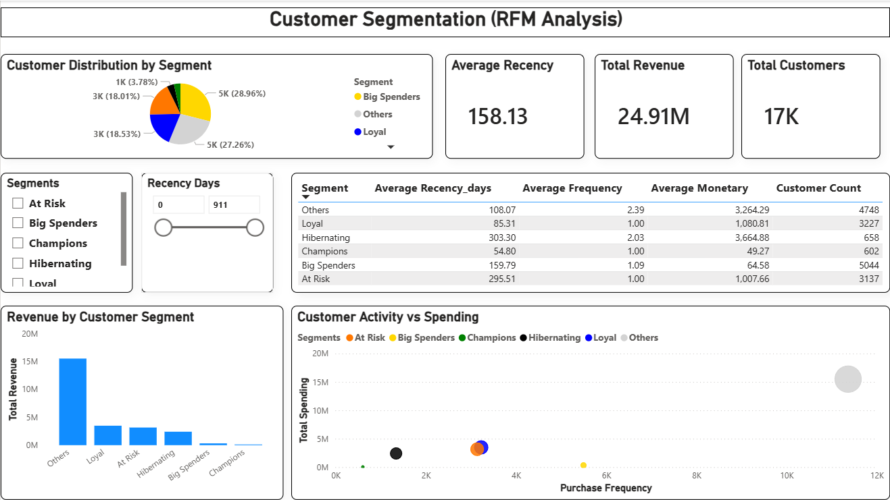

<p align="center">
  
  
  
  
</p>

---

# Customer Segmentation Using RFM Analysis (SQL + Power BI)

An end-to-end customer segmentation project using **RFM (Recency, Frequency, Monetary)** analysis built with SQL and Power BI.  
This project transforms raw transactional data into clear customer segments and business-ready insights.

---

## 🔗 Live Interactive Dashboard
👉 **View the live Power BI dashboard from GitHub Repository**


---

## 📌 Project Overview

This project applies the **RFM framework** to segment customers based on their purchasing behavior.

Using **SQL**, I built a full analytical pipeline that:
- Aggregates customer transaction history
- Calculates Recency, Frequency, and Monetary values
- Scores customers on a 1–5 scale for each RFM metric
- Generates combined RFM codes (e.g., 545, 321)
- Classifies customers into actionable segments

The results are visualized in **Power BI** through an interactive dashboard designed to help marketing and business teams understand customer value and behavior.

This project demonstrates the full analytics workflow:

**SQL modeling → segmentation logic → Power BI dashboard → business insights**

---

## ❓ Business Questions Answered

This project answers key business and marketing questions such as:

- Who are our **most valuable customers**?
- Which customers are **high-frequency and high-spending**?
- Which customers are **loyal but under-monetized**?
- Which customers are **at risk of churn**?
- How much **revenue is contributed by each segment**?
- Is there a clear relationship between **purchase frequency and spending**?
- Which segments should be prioritized for:
  - Retention campaigns  
  - Upsell opportunities  
  - Win-back strategies  
  - Low-cost reactivation  

---

## 🛠 Tools & Technologies

- **SQL (PostgreSQL)**  
  - Aggregations  
  - Window functions  
  - NTILE-based scoring  
  - Reusable analytical views  

- **Power BI**
  - KPI cards
  - Slicers and filters
  - Column, pie, and scatter charts
  - Segment-level analysis

---

## 🧱 Dataset & Data Model

The analysis is built on a transactional sales view (`vw_sales`) containing:

- `order_date` — purchase date  
- `order_number` — unique order identifier  
- `customer_key` — customer ID  
- `product_key` — product identifier  
- `order_quantity` — units sold  
- `product_price` — unit price  
- `revenue` — quantity × price  

These fields are sufficient to compute:
- **Recency** → days since last purchase  
- **Frequency** → number of orders  
- **Monetary** → total customer spend  

No external dataset is required — the project relies entirely on SQL transformations.

---

## 📂 Project Structure

```
customer-segmentation-rfm-analysis-powerbi/
│
├── README.md
├── rfm_sql_views.sql
├── rfm_customer_segmentation_dashboard.pbix
├── Screenshot/
│   └── Dashboard.png
```
---

## 📊 Dashboards Included

### 1️⃣ Segment Overview
- Customer segment distribution
- Total customers
- Total revenue
- Average recency

### 2️⃣ Revenue & Value Analysis
- Revenue contribution by segment
- Segment-wise monetary comparison

### 3️⃣ Customer Behavior Analysis
- Frequency vs monetary scatter plot
- Segment clustering and patterns


## 🧮 SQL Pipeline (RFM Logic)

The RFM logic is implemented entirely in SQL using a series of views.

### 1️⃣ Customer Purchase Summary
```sql
CREATE OR REPLACE VIEW vw_customer_summary AS
SELECT
	customer_key,
	COUNT(DISTINCT order_number) AS total_orders,
	SUM(revenue) AS total_revenue,
	MAX(order_date) AS last_order_date
FROM vw_sales
GROUP BY customer_key;
```
### 2️⃣ RFM Base Metrics
```sql
CREATE OR REPLACE VIEW vw_rfm_base AS 
WITH snapshot AS (
	SELECT MAX(order_date) AS snapshot_date
	FROM vw_sales
)
SELECT
	cs.customer_key,
	cs.total_orders AS frequency,
	cs.total_revenue AS monetary,
	cs.last_order_date,
	s.snapshot_date,
	(s.snapshot_date - cs.last_order_date) AS recency_days
FROM vw_customer_summary cs
CROSS JOIN snapshot s;
```
### 3️⃣ RFM Scoring
```sql
CREATE OR REPLACE VIEW vw_rfm_scores AS
SELECT
	customer_key,
	recency_days,
	frequency,
	monetary,
	NTILE(5) OVER (ORDER BY recency_days ASC) AS r_raw,
	NTILE(5) OVER (ORDER BY frequency DESC) AS f_score,
	NTILE(5) OVER (ORDER BY monetary DESC) AS m_score
FROM vw_rfm_base;
```
###4️⃣ Final RFM Codes
```sql
CREATE OR REPLACE VIEW vw_rfm_final AS
SELECT
	customer_key,
	recency_days,
	frequency,
	monetary,
	(6 - r_raw) AS r_score,
	f_score,
	m_score,
	CONCAT((6 - r_raw), f_score, m_score) AS rfm_code
FROM vw_rfm_scores;
```
###5️⃣ Customer Segmentation
```sql
CREATE OR REPLACE VIEW vw_rfm_segmented AS
SELECT
	customer_key,
	recency_days,
	frequency,
	monetary,
	r_score,
	f_score,
	m_score,
	rfm_code,
	CASE
		WHEN r_score >= 4 AND f_score >= 4 AND m_score >= 4 THEN 'Champions'
		WHEN f_score >= 4 AND r_score >= 3 THEN 'Loyal'
		WHEN m_score >= 4 AND f_score BETWEEN 2 AND 3 THEN 'Big Spenders'
		WHEN r_score <= 2 AND f_score >= 3 THEN 'At Risk'
		WHEN r_score = 1 AND f_score <= 2 THEN 'Hibernating'
		ELSE 'Others'
	END AS segment
FROM vw_rfm_final;
```

---

## 🚀 How to Run This Project
---
### ✅ Option 1 — View Dashboard Only
1. Download `rfm_customer_segmentation_dashboard.pbix`
2. Open in Power BI Desktop
3. Explore visuals directly or re-point the data source if needed

--- 

### ✅ Option 2 — Rebuild Full SQL + Power BI Pipeline
1. Create or use an existing PostgreSQL database
2. Ensure a transactional sales table exists
3. Run the SQL views in this order:
	- `vw_customer_summary`
 	- `vw_rfm_base`
  	- `vw_rfm_scores`
   	- `vw_rfm_final`
   	- `vw_rfm_segmented`
4. Connect Power BI to the final view
5. Refresh and explore the dashboard

---

## 📸 Dashboard Screenshots



---

## 📈 Key Insights & Findings 

### 🔹 Champions Drive the Majority of Revenue
- Champions purchase frequently, spend the most, and have very recent activity.
- They should be prioritized with loyalty programs and exclusive offers

### 🔹 Loyal Customers Are Strong Upsell Candidates
- Loyal customers buy often but spend slightly less than Champions.
- Targeted bundles and premium offers can increase their value.

### 🔹 Big Spenders Have High Value but Lower Frequency
- This group spends heavily but purchases less often.
- Personalized remarketing and premium positioning can increase engagement.

### 🔹 At Risk Customers Show Churn Signals
- Previously active customers with declining recency.
- Win-back campaigns and time-sensitive offers are recommended.

### 🔹 Hibernating Customers Are Low Priority
- Low frequency, low spend, and long inactivity.
- Only low-cost reactivation efforts are justified.

### 🔹 Clear Frequency–Spending Relationship
- Higher purchase frequency strongly correlates with higher total spending, confirming core RFM assumptions.

---

## 📬 Contact

**Author:** Ritvika  

If you’d like to discuss this project, collaborate, or talk about data analyst roles:

- 💼 LinkedIn: [Ritvika Mittal](https://www.linkedin.com/in/ritvikamittal/)
- 🧑‍💻 GitHub: [ritvika-mittal](https://github.com/ritvika-mittal)
